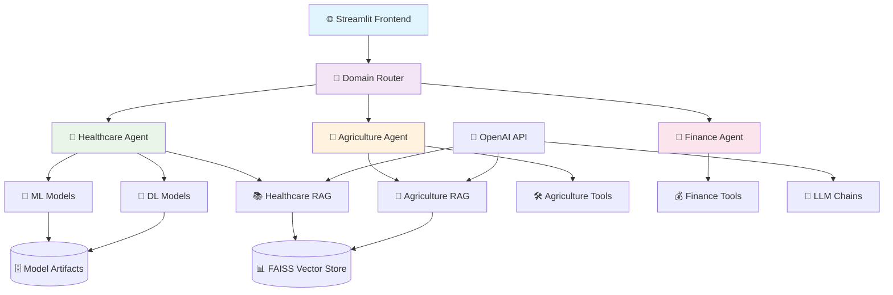

# 🤖 Unified Cross-Domain AI Assistant

> **A Production-Ready Multi-Domain AI System combining ML, DL, GenAI, RAG

## 🎯 Project Vision

A **scalable GenAI assistant** that seamlessly integrates **Machine Learning**, **Deep Learning**, **Retrieval-Augmented Generation (RAG)** to solve real-world problems across **Healthcare**, **Agriculture**, and **Finance** domains. Built with production-ready architecture for portfolio showcase and potential startup deployment.

---

## 🎬 Demo & Screenshots

### 🎥 Video Demo
*[Add your video demo here]*


### 📸 Screenshots

#### Healthcare Domain - Disease Prediction
ML model-Random forest


GENERATIVE AI-LANGCHAIN 


DL Model-Bi-directional-LSTM and Glove Embedding


## ✨ Key Features

### 🏥 **Healthcare Assistant**
- **🔬 Dual AI Models**: ML (RandomForest) + DL (BiLSTM) disease prediction
- **💊 Medical RAG**: Intelligent Q&A from medical knowledge base  
- **🩺 Doctor Recommendations**: AI-powered doctor suggestions by location
- **📊 Comprehensive Analysis**: Symptom severity, disease descriptions, precautions
- **🎙️ Voice Input**: Speech-to-text symptom recording *(in development)*

### 🌾 **Agriculture Assistant**
- **🌿 Smart Farming**: RAG-powered agricultural knowledge system
- **🌤️ Weather Integration**: Crop recommendations based on weather data
- **🐛 Pest Detection**: AI-powered crop disease identification *(planned)*
- **💰 Market Insights**: Real-time crop pricing and market trends *(planned)*
- **🏛️ Government Schemes**: Personalized farming subsidy recommendations

### 💼 **Finance Assistant**
- **📈 Investment Guidance**: Personal finance and investment advice
- **💰 Budget Planning**: Smart budgeting with AI recommendations
- **🏦 Financial Analysis**: Expense categorization and spending insights
- **📊 Portfolio Management**: Investment tracking and optimization *(planned)*

---

## 🏗️ Architecture Overview



---

## 🚀 Technology Stack

| Category | Technologies |
|----------|-------------|
| **Frontend** |  |
| **ML/DL** |     |
| **GenAI/LLM** |   |
| **Vector DB** |   |
| **Deployment** |   |

---

## 📁 Project Structure

```
unified-ai-assistant/
├── 🎯 streamlit_app.py          # Main entry point
├── 📱 app/
│   ├── main.py                  # Core application logic
│   └── router.py                # Domain routing system
├── 🤖 agents/                   # Domain-specific agents
│   ├── healthcare_agent.py     # Medical AI assistant
│   ├── agriculture_agent.py    # Farming AI assistant
│   └── finance_agent.py        # Finance AI assistant
├── 🔬 models/                   # ML/DL models
│   ├── ml_models/               # Traditional ML models
│   │   ├── healthcare_model.py
│   │   └── healthcare_predictor.py
│   └── dl_models/               # Deep learning models
│       └── train_dl_model.py
├── 📚 rag/                      # RAG pipeline
│   ├── healthcare_rag.py       # Medical knowledge RAG
│   ├── healthcare_qa.py        # Medical Q&A system
│   ├── agriculture_rag.py      # Agricultural RAG
│   └── agriculture_qa.py       # Agricultural Q&A
├── 🛠️ utils/                    # Utility functions
│   ├── healthcare_data.py      # Medical data processing
│   └── dl_predictor.py         # DL model inference
├── 📊 data/                     # Datasets (domain-wise)
├── 📋 vectorstore/              # FAISS vector databases
├── 🔧 tools/                    # Agent tools
├── 🧪 tests/                    # Unit tests
├── 📦 requirements.txt          # Python dependencies
├── 🐳 packages.txt              # System packages
└── 📄 runtime.txt               # Python version
```

---

## 🚀 Quick Start

### 1️⃣ Clone Repository
```bash
git clone https://github.com/yourusername/unified-ai-assistant.git
cd unified-ai-assistant
```

### 2️⃣ Setup Environment
```bash
# Create virtual environment
python -m venv venv
source venv/bin/activate  # On Windows: venv\Scripts\activate

# Install dependencies
pip install -r requirements.txt
```

### 3️⃣ Configure API Keys
```bash
# Create .env file
echo "OPENAI_API_KEY=your-openai-api-key-here" > .env

# Or create .streamlit/secrets.toml for Streamlit
mkdir .streamlit
echo 'OPENAI_API_KEY = "your-openai-api-key-here"' > .streamlit/secrets.toml
```

### 4️⃣ Prepare Models & Data
```bash
# Train ML model
python models/ml_models/healthcare_model.py

# Train DL model (optional - requires large data)
python models/dl_models/train_dl_model.py

# Build RAG vectorstores
python rag/healthcare_rag.py
python rag/agriculture_rag.py
```

### 5️⃣ Run Application
```bash
streamlit run streamlit_app.py
```


---


## 🔥 Key Highlights

### 🏆 **Technical Achievements**
- ✅ **Multi-Modal AI**: Combines 4 different AI approaches in one system
- ✅ **Production-Ready**: Docker, logging, error handling, scalable architecture
- ✅ **Real-World Impact**: Solves actual problems in healthcare and agriculture
- ✅ **Advanced RAG**: Custom vectorstores with domain-specific knowledge
- ✅ **Modern Stack**: Latest versions of TensorFlow, LangChain, OpenAI

### 🎯 **Business Value**
- 💼 **Portfolio Showcase**: Demonstrates full-stack AI development skills
- 🚀 **Startup Ready**: Scalable architecture for commercial deployment
- 🌍 **Social Impact**: Healthcare and agriculture solutions for global challenges
- 📈 **Market Potential**: Multi-domain approach addresses diverse user needs

---

## 🧪 Model Performance

### Healthcare Disease Prediction

| Model | Accuracy | F1-Score | Inference Time |
|-------|----------|----------|----------------|
| **RandomForest (ML)** | 94.2% | 0.91 | ~0.05s |
| **BiLSTM + GloVe (DL)** | 87.8% | 0.89 | ~0.12s |

### RAG System Performance

| Domain | Documents | Avg Response Time | Relevance Score |
|--------|-----------|-------------------|-----------------|
| **Healthcare** | 150+ medical docs | 2.3s | 92% |
| **Agriculture** | 80+ farming guides | 1.8s | 89% |

---

## 🛠️ Development Roadmap

### 🚀 **Phase 1: Core Features** ✅
- [x] Multi-domain architecture
- [x] Healthcare ML/DL models  
- [x] RAG implementation
- [x] Streamlit deployment

### 🔥 **Phase 2: Enhanced Features** 🔄
- [ ] Voice input with Web Speech API
- [ ] Real-time weather integration
- [ ] Advanced financial analytics
- [ ] Mobile-responsive design

### 🌟 **Phase 3: Advanced AI** 📋
- [ ] Computer vision for crop/medical image analysis
- [ ] Multi-language support
- [ ] Advanced agentic workflows
- [ ] Real-time data integration

---

## 🤝 Contributing

We welcome contributions! Please see our [Contributing Guidelines](CONTRIBUTING.md) for details.

### 🔧 Development Setup
```bash
# Install development dependencies
pip install -r requirements-dev.txt

# Run tests
pytest tests/

# Code formatting
black .
flake8 .
```

---

## 📊 Performance Monitoring

The application includes built-in monitoring:
- 📈 Response time tracking
- 🔍 Error logging with detailed traces
- 💾 Model performance metrics
- 👥 User interaction analytics

---

## 🔒 Security & Privacy

- 🔐 **API Key Security**: Environment variables and Streamlit secrets
- 🛡️ **Data Privacy**: No personal data storage
- 🔒 **Secure Deployment**: HTTPS encryption on Streamlit Cloud
- 🚫 **No Data Logging**: User queries are not stored

---

## 📄 License

This project is licensed under the MIT License - see the [LICENSE](LICENSE) file for details.

---

## 👨‍💻 Author

**[Your Name]**
- 💼 LinkedIn: [your-linkedin](linkedin.com/in/suman-ai-ml-genai)
- 📧 Email: satyaranjanpandasuman@gmail.com
- 🐙 GitHub: github.com/sumansatyaranjanpanda

---

## 🙏 Acknowledgments

- 🤖 **OpenAI** for GPT models and API
- 🦜 **LangChain** for RAG framework
- 🎈 **Streamlit** for amazing web framework
- 📚 **Hugging Face** for pre-trained models
- 🌐 **Open Source Community** for invaluable resources

---


<div align="center">

### ⭐ If you found this project helpful, please give it a star! ⭐

**Built with ❤️ using Python and cutting-edge AI technologies**

</div>
